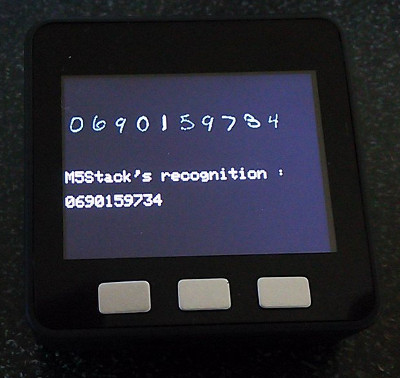
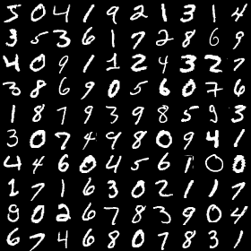
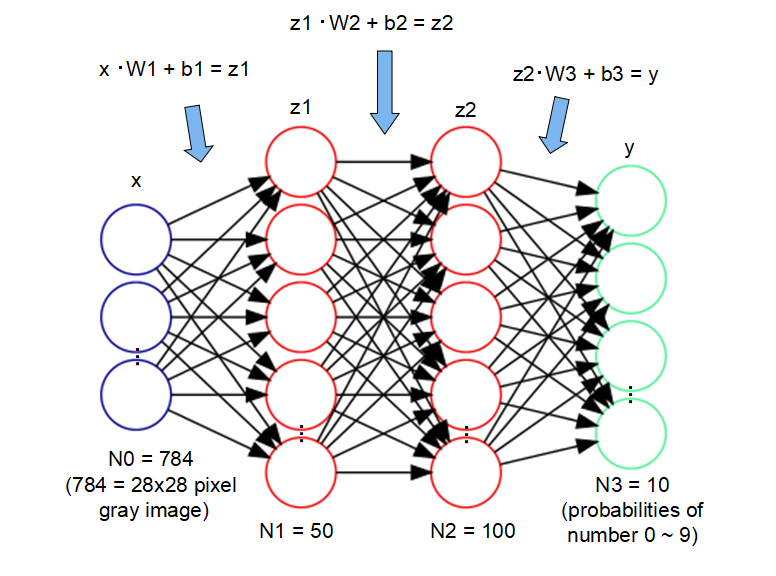

# M5Stack_NeuralNetwork
handwritten digits recognition by M5Stack
 
 
## Prepare
- [M5Stack](https://www.switch-science.com/catalog/3647/)  : Switch Science

## Development Environment
- [Arduino IDE](https://www.arduino.cc/en/main/software)
- [arduino-esp32](https://github.com/espressif/arduino-esp32)

## Reference

 ## MNIST
- The MNIST database of handwritten digits, available from this page, has a training set of 60,000 examples, and a test set of 10,000 examples.
-
- [THE MNIST DATABASE](http://yann.lecun.com/exdb/mnist/)
 
## About Neural Network
Neural Network are computing systems vaguely inspired by the biological neural networks that constitute animal brains.
M5Stack converts image data of handwritten digits to corresponding number by Neural Network.
This code uses the weight coefficient matrix of a earnt neural network. 
-
